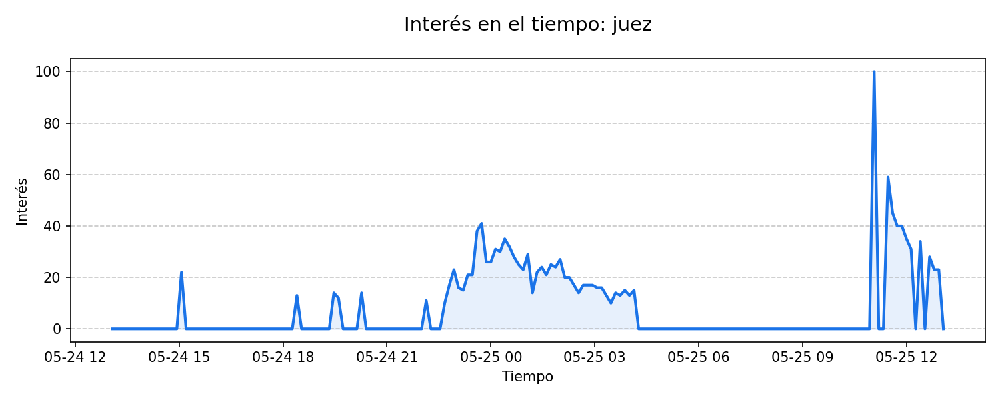
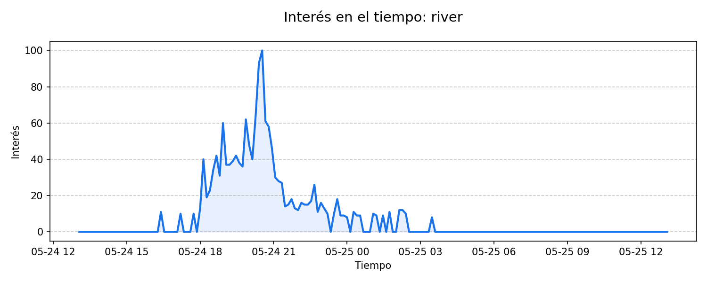

# Reporte de Tendencias — 2026-05-25

**Monitoreo de Tendencias — Guatemala**

**Resumen del día:** Este reporte identifica las principales tendencias de búsqueda en Guatemala dentro de las categorías de Política, Gobierno, Negocios y Finanzas en las últimas 24 horas.

## 1. juez
*Tráfico: 2000+ | Temas: Law and Government*

La búsqueda “juez” aparece como tendencia activa en Google Trends, con más de 2000+ búsquedas, un aumento de 500% y actividad registrada hace 13.8 horas. Según reportes de Prensa Libre, Canal Antigua y Tv Azteca Guatemala, Juez libera a sospechosos de ataque contra concejal de Chinautla, lo que ha generado interés y seguimiento sobre el impacto de esta noticia.

### Fuentes y contexto
- [Juez libera a sospechosos de ataque contra concejal de Chinautla](https://www.prensalibre.com/ahora/guatemala/justicia/juez-libera-a-sospechosos-de-ataque-contra-concejal-de-chinautla/) (Prensa Libre)
- [Capturan a sospechosos de ataque armado contra concejal de Chinautla y su esposo](https://canalantigua.tv/2026/05/22/capturan-sospechosos-ataque-armado-contra-concejal-de-chinautla-y-esposo/) (Canal Antigua)
- [Capturan a presuntos responsables de disparar a concejal y su esposo](https://tvaztecaguate.com/nacionales/2026/05/22/disparan-contra-concejal-y-su-esposo-mientras-transitaban-en-chinautla/) (Tv Azteca Guatemala)

---

## 2. river
*Tráfico: 500+ | Temas: Law and Government*

La búsqueda “river” aparece como tendencia activa en Google Trends, con más de 500+ búsquedas, un aumento de 1000% y actividad registrada hace 18.5 horas. Según reportes de Biloxi Sun Herald, SuperTalk Mississippi Media y WLOX, Body of naked man recovered near Biloxi River after alleged attack, police say, lo que ha generado interés y seguimiento sobre el impacto de esta noticia.

### Fuentes y contexto
- [Body of naked man recovered near Biloxi River after alleged attack, police say](https://www.sunherald.com/news/local/counties/harrison-county/article315881517.html) (Biloxi Sun Herald)
- [Naked man emerges from Biloxi River, killed after attacking neighbor: police](https://www.supertalk.fm/naked-man-emerges-from-biloxi-river-killed-after-attacking-citizen-police/) (SuperTalk Mississippi Media)
- [Naked man shot, killed after emerging from Biloxi River, attacking Woolmarket man](https://www.wlox.com/2026/05/25/naked-man-shot-killed-after-emerging-biloxi-river-attacking-woolmarket-man/) (WLOX)

---

## 3. thelma aldana
*Tráfico: 200+ | Temas: Law and Government, Politics*

La búsqueda “thelma aldana” aparece como tendencia activa en Google Trends, con más de 200+ búsquedas, un aumento de 600% y actividad registrada hace 19.2 horas. Según reportes de Infobae, Diario El Mundo y ABC, La exfiscal Thelma Aldana condiciona su retorno a Guatemala a cambios en el Ministerio Público, lo que ha generado interés y seguimiento sobre el impacto de esta noticia.

### Fuentes y contexto
- [La exfiscal Thelma Aldana condiciona su retorno a Guatemala a cambios en el Ministerio Público](https://www.infobae.com/guatemala/2026/05/23/la-exfiscal-thelma-aldana-condiciona-su-retorno-a-guatemala-a-cambios-en-el-ministerio-publico/) (Infobae)
- [La exfiscal Thelma Aldana ve posible regresar a Guatemala tras salida de Consuelo Porras](https://diario.elmundo.sv/el-mundo/la-exfiscal-thelma-aldana-ve-posible-regresar-a-guatemala-tras-salida-de-consuelo-porras) (Diario El Mundo)
- [Exfiscal de Guatemala exiliada en EEUU: "Vemos una luz para volver a casa"](https://www.abc.es/espana/exfiscal-guatemala-exiliada-eeuu-vemos-luz-volver-20260522181237-nt.html) (ABC)

---

### Metodología
Datos extraídos de Google Trends para Guatemala. Se priorizan tendencias con crecimiento acelerado en las últimas 24 horas.