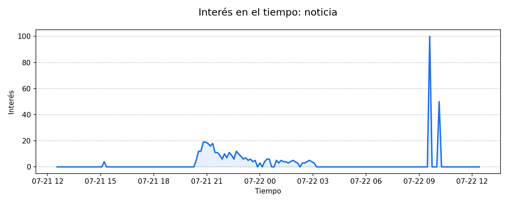

# Reporte de Tendencias — 2026-07-22

**Monitoreo de Tendencias — Guatemala**

**Resumen del día:** Este reporte identifica las principales tendencias de búsqueda en Guatemala dentro de las categorías de Política, Gobierno, Negocios y Finanzas en las últimas 24 horas.

## 1. crimen
*Tráfico: 200+ | Temas: Law and Government*

La búsqueda “crimen” aparece como tendencia activa en Google Trends, con más de 200+ búsquedas, un aumento de 300% y actividad registrada hace 8.4 horas. Según reportes de EFE - Agencia de noticias, RTVE.es y Cuatro, La investigación descarta por el momento violencia machista en el asesinato de Benahavís, lo que ha generado interés y seguimiento sobre el impacto de esta noticia.

### Fuentes y contexto
- [La investigación descarta por el momento violencia machista en el asesinato de Benahavís](https://efe.com/andalucia/2026-07-22/la-investigacion-descarta-por-el-momento-violencia-machista-en-el-asesinato-de-benahavis/) (EFE - Agencia de noticias)
- [Las Mañanas de Andalucía - 22/07/2026](https://www.rtve.es/play/audios/andalucia-informativos/mananas-andalucia-22-07-2026/17165057/) (RTVE.es)
- [Última hora | El cadáver de la mujer degollada en Málaga estaba rodeado de billetes](https://www.cuatro.com/noticias/sociedad/20260722/ultima-hora-cadaver-mujer-degollada-malaga-rodeado-billetes_18_019779083.html) (Cuatro)

---

## 2. gasolina
*Tráfico: 1000+ | Temas: Business and Finance*

La búsqueda “gasolina” aparece como tendencia activa en Google Trends, con más de 1000+ búsquedas, un aumento de 1000% y actividad registrada hace 19.1 horas. Según reportes de Prensa Libre, La Hora y Canal Antigua, Cuáles son las razones de los aumentos en los precios de los combustibles, lo que ha generado interés y seguimiento sobre el impacto de esta noticia.

### Fuentes y contexto
- [Cuáles son las razones de los aumentos en los precios de los combustibles](https://www.prensalibre.com/economia/cuales-son-las-razones-de-los-aumentos-en-los-precios-de-los-combustibles/) (Prensa Libre)
- [Gobierno analiza nuevo apoyo económico ante incremento en el precio de los combustibles](https://lahora.gt/nacionales/ypena/2026/07/21/gobierno-analiza-nuevo-apoyo-economico-ante-incremento-en-el-precio-de-los-combustibles-now/) (La Hora)
- [Gretexpa denuncia destinar entre 20 % y 40 % de ingresos al pago de extorsiones](https://canalantigua.tv/2026/07/21/gretexpa-denuncia-destinar-entre-20-y-40-de-ingresos-al-pago-de-extorsiones/) (Canal Antigua)

---

## 3. noticia
*Tráfico: 2000+ | Temas: Other*

La búsqueda “noticia” aparece como tendencia activa en Google Trends, con más de 2000+ búsquedas, un aumento de 1000% y actividad registrada hace 16.1 horas. Según reportes de Forbes España, Asturias Mundial y El Comercio, El Principado de Asturias ve «buena noticia» el acercamiento entre Santa Bárbara e Indra, lo que ha generado interés y seguimiento sobre el impacto de esta noticia.

### Fuentes y contexto
- [El Principado de Asturias ve «buena noticia» el acercamiento entre Santa Bárbara e Indra](https://forbes.es/ultima-hora/984826/el-principado-de-asturias-ve-buena-noticia-el-acercamiento-entre-santa-barbara-e-indra/) (Forbes España)
- [Indra y Barros entran en fase decisiva: qué se sabe y qué falta para activar la fábrica militar de Langreo](https://www.asturiasmundial.com/noticia/143954/indra-barros-entran-fase-decisiva-sabe-falta-activar-fabrica-militar-langreo/) (Asturias Mundial)
- [El CEO de Indra transmite tranquilidad por los retrasos en El Tallerón](https://www.elcomercio.es/economia/ceo-indra-transmite-tranquilidad-retrasos-talleron-20260717084012-nt.html) (El Comercio)

---

### Metodología
Datos extraídos de Google Trends para Guatemala. Se priorizan tendencias con crecimiento acelerado en las últimas 24 horas.