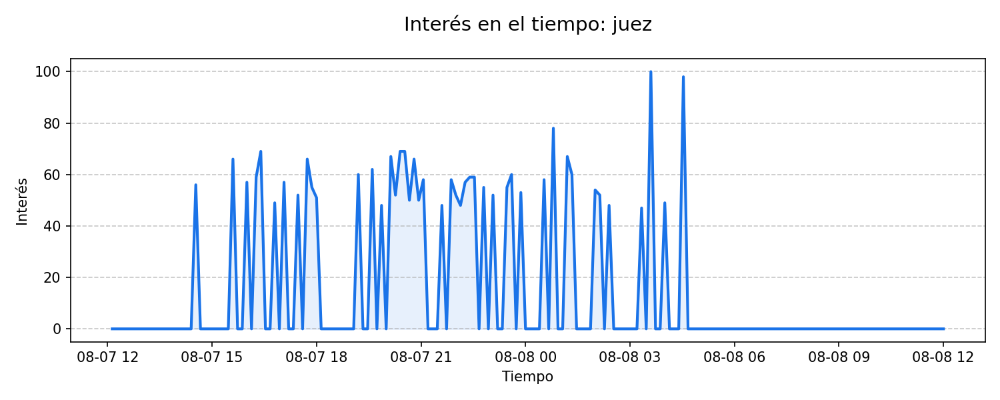
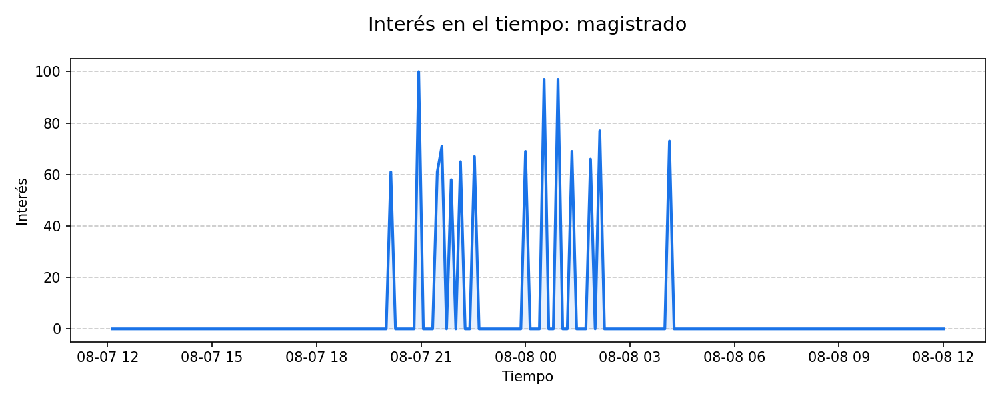
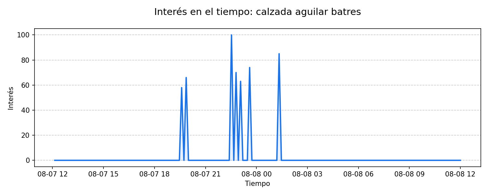

# Reporte de Tendencias — 2026-08-08

**Monitoreo de Tendencias — Guatemala**

**Resumen del día:** Este reporte identifica las principales tendencias de búsqueda en Guatemala dentro de las categorías de Política, Gobierno, Negocios y Finanzas en las últimas 24 horas.

## 1. juez
*Tráfico: 2000+ | Temas: Law and Government*

La búsqueda “juez” aparece como tendencia activa en Google Trends, con más de 2000+ búsquedas, un aumento de 800% y actividad registrada hace 21.2 horas. Según reportes de Prensa Libre, La Hora y Emisoras Unidas, Caso La Línea: juez dicta sobreseimiento y cierra proceso penal a favor de Julio César Emanuel Miranda González, lo que ha generado interés y seguimiento sobre el impacto de esta noticia.

### Fuentes y contexto
- [Caso La Línea: juez dicta sobreseimiento y cierra proceso penal a favor de Julio César Emanuel Miranda González](https://www.prensalibre.com/guatemala/justicia/caso-la-linea-juez-dicta-sobreseimiento-y-cierra-proceso-penal-a-favor-de-julio-cesar-emanuel-miranda-gonzalez-breaking/) (Prensa Libre)
- [Prueba de grafología le da la libertad a implicado en caso La Línea](https://lahora.gt/nacionales/sosegueda/2026/08/07/prueba-de-grafologia-le-da-la-libertad-a-implicado-en-caso-la-linea/) (La Hora)
- [Caso La Línea: Dictan sobreseimiento a favor de Julio César Miranda](https://emisorasunidas.com/nacional/2026/08/07/caso-la-linea-sobreseimiento-julio-cesar-miranda/) (Emisoras Unidas)

---

## 2. magistrado
*Tráfico: 1000+ | Temas: Law and Government, Politics*

La búsqueda “magistrado” aparece como tendencia activa en Google Trends, con más de 1000+ búsquedas, un aumento de 1000% y actividad registrada hace 15.2 horas. A pesar del alto volumen de búsqueda, no se han detectado reportes de prensa directos vinculados en este momento.

---

## 3. calzada aguilar batres
*Tráfico: 1000+ | Temas: Business and Finance*

La búsqueda “calzada aguilar batres” aparece como tendencia activa en Google Trends, con más de 1000+ búsquedas, un aumento de 1000% y actividad registrada hace 16.2 horas. Según reportes de Prensa Libre, Guatemala.com y La Hora, Desde occidente, sur y oriente: así son las rutas alternas que Emetra propone para adentrase a Ciudad de Guatemala, lo que ha generado interés y seguimiento sobre el impacto de esta noticia.

### Fuentes y contexto
- [Desde occidente, sur y oriente: así son las rutas alternas que Emetra propone para adentrase a Ciudad de Guatemala](https://www.prensalibre.com/guatemala/comunitario/asi-son-las-nuevas-rutas-alternas-habilitadas-en-el-occidente-sur-y-oriente-de-la-ciudad-de-guatemala/) (Prensa Libre)
- [PMT habilitó 3 nuevos carriles reversibles en Ciudad Guatemala: horarios y dónde funcionan](https://www.guatemala.com/noticias/comunidad/pmt-habilito-3-nuevos-carriles-reversibles-ciudad-guatemala-y-compartio-rutas-alternas-trafico.html) (Guatemala.com)
- [De la Aguilar Batres hacia bulevar Liberación sin pasar por el Trébol: estas son las rutas alternas](https://lahora.gt/nacionales/ypena/2026/08/07/de-la-aguilar-batres-hacia-bulevar-liberacion-sin-pasar-por-el-trebol-estas-son-las-rutas-alternas-now/) (La Hora)

---

### Metodología
Datos extraídos de Google Trends para Guatemala. Se priorizan tendencias con crecimiento acelerado en las últimas 24 horas.